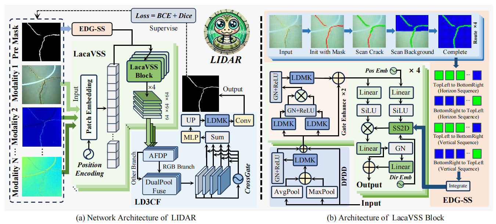
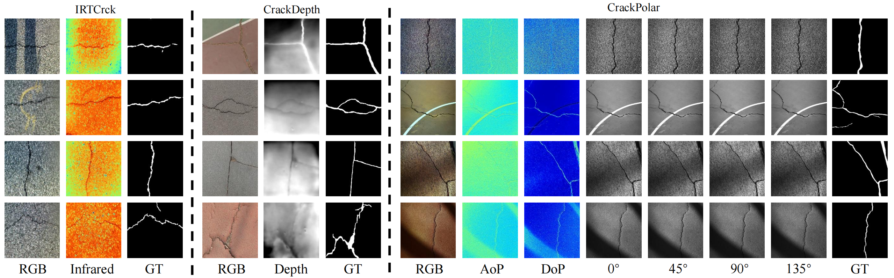
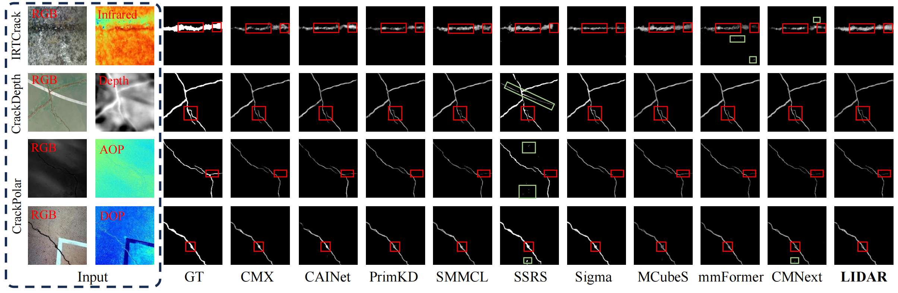
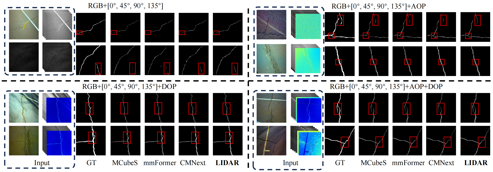
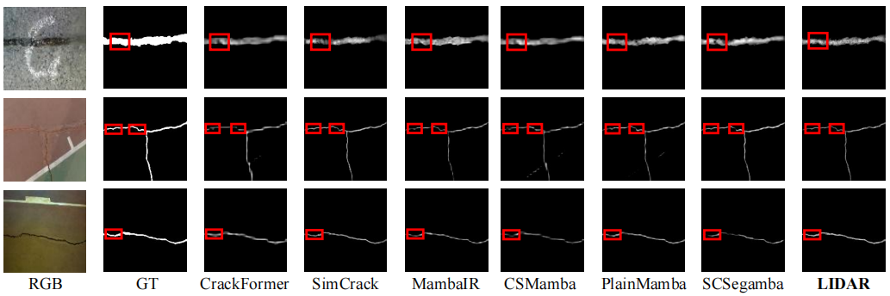

<div align="center">
  <h1>LIDAR</h1>
</div>
<p align="center">
    
</p>

<div align="center">
<h4>[ACM MM 2025] LIDAR: Lightweight Adaptive Cue-Aware Fusion Vision Mamba for Multimodal Segmentation of Structural Cracks</h4>
</div>
<div align="center">
<h6>🖐😭🤚  🌟If this work is useful to you, please give this repository a Star!🌟  🖐😭🤚</h6>
</div>


<div align="center">
      <a href="https://arxiv.org/abs/2507.22477"></a>
  <a href="https://www.apache.org/licenses/" style="margin-left:10px;"></a>
</div>

## 📬 News
- **2025-07-31**: The preprint of **LIDAR** has been posted on [**📤️arXiv**](https://arxiv.org/abs/2507.22477)!
- **2025-07-30**: The code for **LIDAR** is publicly available in this repository! 📦
- **2025-07-06**: 🎉🎉🎉We are delighted to announce that our **LIDAR** has been accepted by the **ACM MM 2025**! 🖐😭🤚

## ⚒ Method Overview

<p align="center">
    
</p>


Achieving pixel-level segmentation with low computational cost using multimodal data remains a key challenge in crack segmentation tasks. Existing methods lack the capability for adaptive perception and efficient interactive fusion of cross-modal features. To address these challenges, we propose a Lightweight Adaptive Cue-Aware vision Mamba network (LIDAR), which efficiently perceives and integrates morphological and textural cues from different modalities under multimodal crack scenarios, generating clear pixel-level crack segmentation maps. Specifically, LIDAR is composed of a Lightweight Adaptive Cue-Aware Visual State Space module (LacaVSS) and a Lightweight Dual Domain Dynamic Collaborative Fusion module (LD3CF). LacaVSS adaptively models crack cues through the proposed mask-guided Efficient Dynamic Guided Scanning Strategy (EDG-SS), while LD3CF leverages an Adaptive Frequency Domain Perceptron (AFDP) and a dual-pooling fusion strategy to effectively capture spatial and frequency-domain cues across modalities. Moreover, we design a Lightweight Dynamically Modulated Multi-Kernel convolution (LDMK) to perceive complex morphological structures with minimal computational overhead, replacing most convolutional operations in LIDAR. Experiments on three datasets demonstrate that our method outperforms other state-of-the-art (SOTA) methods. On the light-field depth dataset, our method achieves 0.8204 in F1 and 0.8465 in mIoU with only 5.35M parameters.

## 🎮 Getting Start

#### 🗂 Download Datasets

The `CrackPolar`, `CrackDepth` and `IRTCrack` that we use can be downloaded from [Multimodal_Crack_Dataset](https://drive.google.com/file/d/1CRZpsrANmNKGQy-GF5nZ1KkrkWjbjPRU/view?usp=sharing).

<p align="center">
    
</p>


#### ⚙️ Environment Setup

You can create your own conda environment for LIDAR based on the following command:

```shell
conda create -n LIDAR python=3.9 -y
conda activate LIDAR
pip install torch==2.1.2+cu121 torchvision==0.16.2+cu121 torchaudio==2.1.2+cu121
pip install -U openmim
mim install mmcv-full
pip install mamba-ssm==1.2.0
```

#### 🖱️ Train

Before formal training, 10 rounds of pre-training are required and the mask is generated using the pre-training weights file, first, change the value of the `scan_list_json_path` parameter to `pretrain` in `main.py` and run:

```shell
python main.py
```

After pre-training is complete, modify the path to the weight file in `inference_mask.py` to the location of the pre-training weight file and run the following command to generate the mask:

```shell
python inference_mask.py
```

Once the mask has been generated, change the dataset path to the location of the dataset to be pre-scanned in the `./pre_scan/scan.py` file, change the dataset path to the location of the dataset to be pre-scanned and run the following command to generate the JSON file that holds the pre-scan path:

```shell
python scan.py
```

Run the following command to check if the scan sequence was generated correctly:

```shell
python test_scan_json.py
```

Next, change the value of the `scan_list_json_path` parameter in main.py to the location of the pre-scanned JSON file, and run the following command for formal training:

```shell
python main.py
```

**✍️✍️✍️Note:**

- **When conducting the pre-training process**, you need to change the value of the `scan_list_json_path` parameter in `main.py` to `pretrain`, and change the value of `inference_mask` to `True`. 
- **When conducting the formal training**, it is necessary to change the value of `scan_list_json_path` to the `path` of the JSON file, and change the value of `inference_mask` to `False`.

#### ⌨ Test

After training, the weights file can be used for inference:

```shell
python test.py
```

#### 〽️ Evaluate

Run the following commands to calculate the ODS, OIS, F1, and mIoU metrics:

```shell
cd eval
python evaluate.py
```

Run the following command to calculate the Params, FLOPs metrics:

```shell
cd ..
python eval_compute.py
```

## 🔭 Visualization

**Visual comparison under dual-modal input:**

<p align="center">
    
</p>

**Visual comparison under multimodal input:**

<p align="center">
    
</p>

**Visual comparison under RGB single-modal input:**

<p align="center">
    
</p>

## 🏷️ License

This project is released under the [**Apache 2.0**](https://www.apache.org/licenses/) license.

## 🫡 Acknowledgment

This work stands on the shoulders of the following **open-source projects**:

<div style="display: flex; justify-content: center; gap: 30px; flex-wrap: wrap; margin: 20px 0;">
  <div>
    <a href="https://github.com/ChenhongyiYang/PlainMamba" target="_blank">PlainMamba</a> 
    <a href="https://arxiv.org/abs/2403.17695">[Paper]</a>
  </div>
  <div>
    <a href="https://github.com/yhlleo/DeepCrack" target="_blank">DeepCrack</a> 
    <a href="https://www.sciencedirect.com/science/article/abs/pii/S0925231219300566">[Paper]</a>
  </div>
  <div>
    <a href="https://github.com/open-mmlab/mmclassification" target="_blank">mmclassification</a>
  </div>
</div>

## 📟 Contact

If you have any other questions, feel free to contact me at **liuhui1109@stud.tjut.edu.cn** or **liuhui@ieee.org**.
